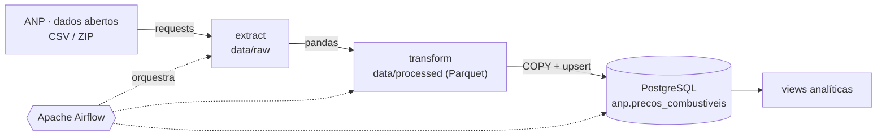

# ⛽ ANP Fuel ETL


Pipeline ETL que coleta a **Série Histórica de Preços de Combustíveis** da ANP (Agência Nacional do
Petróleo), limpa e padroniza os dados com Python/Pandas e os carrega em um data warehouse
PostgreSQL, tudo orquestrado pelo Apache Airflow e executado com Docker.

> Responde perguntas como: *qual o preço médio da gasolina por estado a cada semana? Em qual mês
> o etanol compensou mais que a gasolina? Qual município tem o diesel mais barato?*

📘 **Novo em engenharia de dados?** Leia o [guia passo a passo](docs/guia-passo-a-passo.md): ele
explica cada ferramenta e ensina a rodar tudo no Windows, do zero.

## Arquitetura



| Camada | Onde fica | O que contém |
|---|---|---|
| **raw** | `data/raw/` | Arquivo exatamente como veio da ANP (nunca é alterado) |
| **processed** | `data/processed/` | Dados limpos e tipados em Parquet + JSON com estatísticas de qualidade |
| **warehouse** | PostgreSQL, schema `anp` | Tabela de fatos, tabela de auditoria e views analíticas |

## Stack

Python 3.12 · Pandas · PyArrow · PostgreSQL 16 · Apache Airflow 2.10 · Docker Compose ·
pytest · Ruff · GitHub Actions

## DAGs

| DAG | Gatilho | O que faz |
|---|---|---|
| `anp_incremental_semanal` | Todo sábado às 08:00 (America/Sao_Paulo) | Baixa os arquivos das **últimas 4 semanas** (gasolina, etanol, diesel, GNV) e faz upsert |
| `anp_backfill_historico` | Manual, com parâmetros `start_year` e `end_year` | Carrega **semestres inteiros** desde 2004, uma tarefa por arquivo, em paralelo |

Ambas seguem `init_warehouse → plan_sources → extract → transform → load`, usando *Dynamic Task
Mapping* para criar uma tarefa por arquivo.

## Como rodar

Pré-requisitos: Docker (com Compose) e Git.

```bash
git clone https://github.com/marcos_silva/anp-fuel-etl.git
cd anp-fuel-etl
cp .env.example .env

docker compose build
docker compose up airflow-init      # roda uma vez
docker compose up -d
```

1. Abra **http://localhost:8080** (usuário/senha padrão: `airflow` / `airflow`).
2. Ative a DAG `anp_incremental_semanal` e clique em ▶ **Trigger DAG**.
3. Conecte no banco: `localhost:5433`, base `anp`, usuário/senha `warehouse` / `warehouse`.

```sql
SELECT * FROM anp.vw_preco_medio_semanal_uf
WHERE uf = 'MG' AND produto ILIKE 'GASOLINA%'
ORDER BY semana DESC LIMIT 10;
```

### Sem Airflow (linha de comando)

```bash
python -m venv .venv && source .venv/bin/activate
pip install -r requirements-dev.txt

export PYTHONPATH=src
python -m anp_etl.cli init-db
python -m anp_etl.cli semester --year 2025 --semester 1
python -m anp_etl.cli last4weeks
```

## Modelo de dados

```
anp.precos_combustiveis   PK (cnpj_revenda, produto, data_coleta)
anp.etl_execucoes         auditoria: linhas lidas / rejeitadas / duplicadas / afetadas por arquivo

anp.vw_preco_medio_semanal_uf          preço médio, mín. e máx. por semana, UF e produto
anp.vw_preco_medio_mensal_municipio    preço médio por mês, município e produto
anp.vw_paridade_etanol_gasolina_uf     regra dos 70%: quando o etanol compensa mais que a gasolina
```

## Decisões de projeto

- **Idempotência:** carga via `COPY` em tabela temporária + `INSERT ... ON CONFLICT DO UPDATE`.
  Rodar o mesmo arquivo duas vezes não duplica nada, e preços revisados pela ANP são atualizados
  (só as linhas que realmente mudaram).
- **Portão de qualidade:** linhas com CNPJ inválido, data inválida ou preço fora de R$ 0,50–50,00
  são rejeitadas e contadas; se mais de 20% do arquivo for rejeitado, a tarefa **falha** em vez
  de carregar dado ruim.
- **Layouts instáveis:** a ANP mudou formatos e nomes ao longo dos anos (CSV/ZIP, UTF-8/Latin-1,
  nomes de coluna). O código normaliza nomes de colunas, detecta codificação e separador, e
  falha cedo com mensagem clara se um layout novo aparecer.
- **Passa caminho, não dado:** as tarefas do Airflow trocam apenas caminhos de arquivo (XCom),
  nunca DataFrames.
- **Imports preguiçosos nas DAGs:** pandas só é importado dentro das tarefas, para o Airflow
  interpretar as DAGs rápido.
- **Arquivos mensais não usados de propósito:** os nomes dos arquivos mensais da ANP são
  irregulares; a carga automática usa os semestrais e os de "últimas 4 semanas", que têm URLs
  estáveis. Os mensais podem ser carregados manualmente (`cli url`, veja o guia).

## Testes e CI

```bash
pytest -q       # 24 testes: transformação, extração, regras de URL, qualidade
ruff check .    # lint
```

O GitHub Actions roda lint, testes e validação do `docker-compose.yml` a cada push.

## Limitações conhecidas e próximos passos

- [ ] Camada analítica com **dbt** (modelos staging/marts e testes)
- [ ] Validações declarativas com **Great Expectations** ou **Soda**
- [ ] Cruzar com dados de clima do **INMET** e inflação do **IBGE (IPCA)**
- [ ] Dashboard (Metabase ou Superset) sobre as views
- [ ] Credenciais via **Airflow Connections** em vez de variáveis de ambiente
- [ ] Deploy em nuvem (S3 + RDS, ou BigQuery) com **Terraform**
- [ ] Incluir GLP P13 (a ANP publica em arquivos separados)

## Fonte dos dados

[ANP – Série Histórica de Preços de Combustíveis e de GLP](https://www.gov.br/anp/pt-br/centrais-de-conteudo/dados-abertos/serie-historica-de-precos-de-combustiveis),
dados abertos. Pesquisa semanal de preços ao consumidor em postos revendedores.

## Licença

Código sob licença MIT (veja `LICENSE`). Os dados pertencem à ANP e seguem os termos de uso do
portal de dados abertos.
